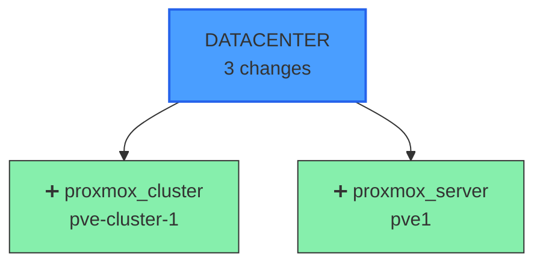
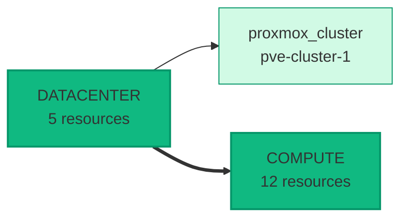
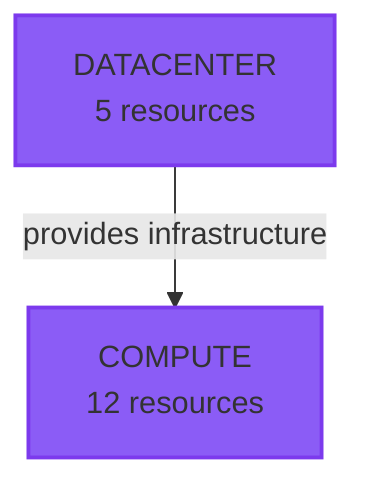

# Graph Command - Interactive Infrastructure Visualization

## Overview

The `graph` command generates interactive Mermaid.js diagrams of your Soverstack infrastructure. It visualizes execution plans, current state, and layer dependencies in beautiful, interactive HTML pages.

---

## Usage

```bash
soverstack graph <platform-yaml> [options]
```

### Options

| Option | Description | Default |
|--------|-------------|---------|
| `-o, --output <path>` | Output file path | `.soverstack/graph.html` |
| `-t, --type <type>` | Graph type: `plan`, `state`, `dependencies`, or `all` | `all` |
| `-f, --format <format>` | Output format: `html` or `mermaid` | `html` |
| `--open` | Open HTML graph in browser after generation | `false` |

---

## Examples

### Generate all diagrams (plan + state + dependencies)

```bash
soverstack graph platform.yaml
```

This generates `.soverstack/graph.html` with 3 interactive diagrams:
- **Execution Plan**: Shows what will be created/updated/deleted
- **Current State**: Shows all deployed resources by layer
- **Layer Dependencies**: Shows how layers depend on each other

### Generate only plan diagram

```bash
soverstack graph platform.yaml --type plan
```

### Generate and open in browser

```bash
soverstack graph platform.yaml --open
```

### Export raw Mermaid syntax

```bash
soverstack graph platform.yaml --format mermaid --output infrastructure.mmd
```

You can then use the `.mmd` file with Mermaid CLI or paste it into [Mermaid Live Editor](https://mermaid.live/).

---

## Graph Types

### 1. Execution Plan (`--type plan`)

Visualizes what changes will be applied:



**Color Legend:**
- 🟢 Green: Create (new resource)
- 🟡 Yellow: Update (modify existing resource)
- 🔴 Red: Delete (remove resource)
- ⚪ Gray: No change

### 2. Current State (`--type state`)

Shows all deployed resources:



**Features:**
- Resources grouped by layer
- Sequential layer connections (datacenter → firewall → bastion → compute → cluster → features)
- Shows first 5 resources per layer (+ count of remaining)

### 3. Layer Dependencies (`--type dependencies`)

Shows architectural dependencies:



**Dependencies:**
- `datacenter` → `compute` (provides infrastructure)
- `datacenter` → `firewall` (network config)
- `firewall` → `bastion` (secure access)
- `bastion` → `compute` (jump host)
- `compute` → `cluster` (worker nodes)
- `cluster` → `features` (platform services)

---

## Interactive HTML Features

The generated HTML includes:

1. **Tabbed Interface**: Switch between plan, state, and dependencies views
2. **Responsive Design**: Works on desktop, tablet, and mobile
3. **Gradient Background**: Beautiful purple gradient design
4. **Color Legend**: Explains what each color means
5. **Animations**: Smooth transitions between tabs
6. **Metadata Header**: Shows project name, environment, generation timestamp

### HTML Screenshot

```
┌────────────────────────────────────────────────┐
│ 📊 Soverstack Infrastructure Graph              │
│ Project: MyApp | Environment: production        │
├────────────────────────────────────────────────┤
│ [Execution Plan] [Current State] [Dependencies]│
├────────────────────────────────────────────────┤
│                                                 │
│           [Interactive Mermaid Diagram]         │
│                                                 │
│                                                 │
├────────────────────────────────────────────────┤
│ Legend:                                         │
│ 🟢 Create  🟡 Update  🔴 Delete  ⚪ No Change  │
└────────────────────────────────────────────────┘
```

---

## Workflow Integration

### Complete Workflow

```bash
# 1. Validate infrastructure
soverstack validate platform.yaml

# 2. Generate execution plan
soverstack plan platform.yaml

# 3. Visualize the plan
soverstack graph platform.yaml --type plan --open

# 4. Review and approve in browser
# (Browser opens with interactive diagram)

# 5. Apply infrastructure
soverstack apply platform.yaml

# 6. Visualize current state
soverstack graph platform.yaml --type state --open

# 7. Later: Destroy infrastructure
soverstack destroy platform.yaml --auto-approve
```

### CI/CD Integration

```yaml
# .github/workflows/infrastructure.yml
- name: Generate Infrastructure Graph
  run: |
    soverstack graph platform.yaml --output graph.html

- name: Upload Graph Artifact
  uses: actions/upload-artifact@v3
  with:
    name: infrastructure-graph
    path: .soverstack/graph.html
```

This allows reviewers to download and view the infrastructure diagram before approving deployments.

---

## Output Files

### HTML Output (default)

```
.soverstack/
├── graph.html          # Interactive HTML with Mermaid.js
├── plan.yaml           # Execution plan (source for graph)
├── state.yaml          # Current state (source for graph)
└── terraform/
    └── ...
```

The HTML file is **self-contained** (includes Mermaid.js CDN link) and can be:
- Opened directly in browser
- Shared via email
- Hosted on static site
- Uploaded to CI/CD artifacts

### Mermaid Output (`--format mermaid`)

```
.soverstack/
└── graph.mmd           # Raw Mermaid syntax
```

Raw Mermaid syntax can be:
- Pasted into Mermaid Live Editor
- Rendered with Mermaid CLI
- Embedded in documentation (GitHub, GitLab, etc.)
- Converted to PNG/SVG/PDF

---

## Technical Details

### Data Sources

| Graph Type | Data Source | Required Command |
|------------|-------------|------------------|
| Plan | `.soverstack/plan.yaml` | `soverstack plan` |
| State | `.soverstack/state.yaml` | `soverstack apply` (after first deployment) |
| Dependencies | Hardcoded layer structure | None (always available) |

### Mermaid.js Integration

- **Version**: 10.x (from CDN)
- **Theme**: Custom theme with Soverstack colors
- **Diagram Types**:
  - `graph TD` (Top-Down) for plan and dependencies
  - `graph LR` (Left-Right) for state

### Browser Compatibility

| Browser | Minimum Version |
|---------|----------------|
| Chrome | 90+ |
| Firefox | 88+ |
| Safari | 14+ |
| Edge | 90+ |

---

## Troubleshooting

### "No data available for graph generation"

**Cause**: No plan or state files exist

**Solution**:
```bash
# Generate plan first
soverstack plan platform.yaml

# Then generate graph
soverstack graph platform.yaml
```

### Graph doesn't open in browser

**Cause**: `--open` flag requires `open` package

**Solution**:
```bash
# Package is auto-installed, but if missing:
npm install open

# Or open manually
start .soverstack/graph.html  # Windows
open .soverstack/graph.html   # macOS
xdg-open .soverstack/graph.html  # Linux
```

### Mermaid diagram not rendering

**Cause**: Internet connection required for CDN

**Solution**: The HTML uses Mermaid.js from CDN. Ensure internet access when opening the HTML file.

---

## Advanced Usage

### Custom Output Paths

```bash
# Output to custom location
soverstack graph platform.yaml --output ~/Desktop/infra-graph.html

# Output to project docs
soverstack graph platform.yaml --output docs/infrastructure/graph.html
```

### Multiple Environments

```bash
# Production
soverstack graph production/platform.yaml --output graphs/production.html

# Staging
soverstack graph staging/platform.yaml --output graphs/staging.html

# Development
soverstack graph dev/platform.yaml --output graphs/dev.html
```

### Version Control

**DO**: Commit raw Mermaid files
```bash
soverstack graph platform.yaml --format mermaid --output docs/architecture.mmd
git add docs/architecture.mmd
```

**DON'T**: Commit HTML files (they're generated artifacts)
```bash
# .gitignore
.soverstack/graph.html
```

---

## Security

The graph command is **SAFE** and follows Soverstack security principles:

✅ **No secrets in diagrams**: Resource IDs and types only (no passwords, keys, or credentials)
✅ **State sanitization**: Uses sanitized state (no sensitive fields)
✅ **Read-only**: Only reads plan/state, never modifies infrastructure
✅ **Self-contained HTML**: No external dependencies except Mermaid.js CDN

---

## Future Enhancements

Planned features for future versions:

1. **Real-time Graph**: Live updates during `apply`
2. **Cost Estimation**: Show estimated costs per resource
3. **Diff View**: Compare two states visually
4. **Export Formats**: PNG, SVG, PDF generation
5. **Filtering**: Show/hide specific layers or resources
6. **Search**: Find resources in diagram
7. **Zoom/Pan**: Navigate large infrastructures
8. **Dark Mode**: Alternative color scheme

---

## Examples by Project Size

### Small Project (1-10 resources)

```bash
soverstack graph platform.yaml --open
```

Single-page diagram with all resources visible.

### Medium Project (10-50 resources)

```bash
soverstack graph platform.yaml --type dependencies --open
```

Focus on high-level architecture, not individual resources.

### Large Project (50+ resources)

```bash
# Generate separate diagrams per layer
soverstack graph platform.yaml --type state --output graphs/full.html

# Or use Mermaid format for custom processing
soverstack graph platform.yaml --format mermaid --output graphs/raw.mmd
```

---

## Conclusion

The graph command provides **instant visualization** of your infrastructure, making it easy to:

- ✅ Review execution plans before applying
- ✅ Understand current infrastructure state
- ✅ Communicate architecture to team members
- ✅ Document infrastructure in version control
- ✅ Debug deployment issues visually

**Next Steps**: Run `soverstack graph platform.yaml --open` to see your infrastructure!
