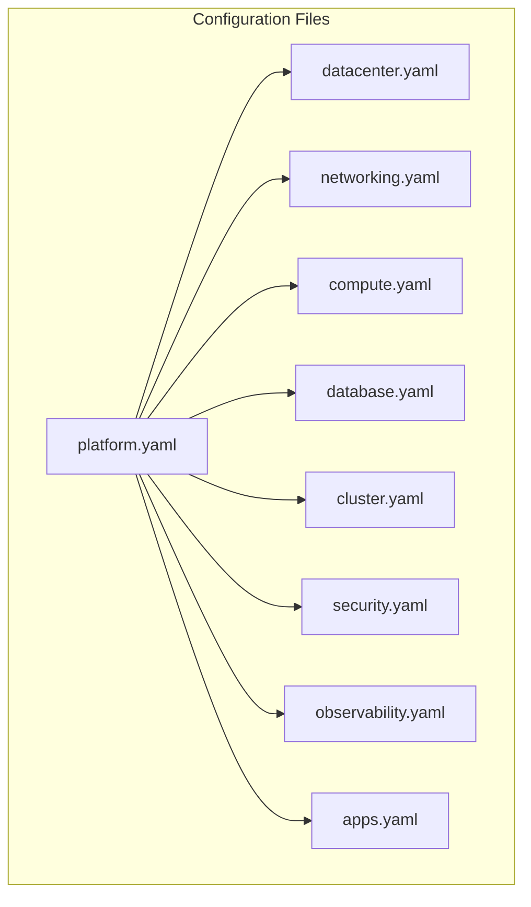
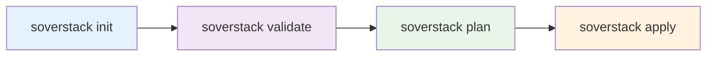

# Getting Started

This section guides you through installing Soverstack and deploying your first infrastructure.

## Contents

1. [Prerequisites](./prerequisites.md) - What you need before starting
2. [Installation](./installation.md) - Installing the Soverstack CLI
3. [Quick Start](./quick-start.md) - Deploy your first infrastructure in 10 minutes
4. [First Deployment](./first-deployment.md) - Complete walkthrough of a production deployment

## Overview

Soverstack follows a layer-based architecture where each layer is configured independently:



### Project Structure

```
my-project/
├── platform.yaml          # Main entry point
├── datacenter.yaml        # Physical Proxmox servers
├── networking.yaml        # Firewall, VPN, DNS
├── compute.yaml           # VMs configuration
├── database.yaml          # PostgreSQL HA
├── cluster.yaml           # Kubernetes configuration
├── security.yaml          # Vault, SSO
├── observability.yaml     # Prometheus, Grafana, Loki
├── apps.yaml              # Applications
├── ssh_config.yaml        # SSH keys + port knocking
├── .env                   # Environment variables
└── .soverstack/           # State and cache
```

## Workflow



| Command | Description |
|---------|-------------|
| `soverstack init` | Generate project structure |
| `soverstack validate` | Check configuration |
| `soverstack plan` | Preview changes |
| `soverstack apply` | Deploy infrastructure |

## Next Steps

Start with [Prerequisites](./prerequisites.md) to ensure your environment is ready.
