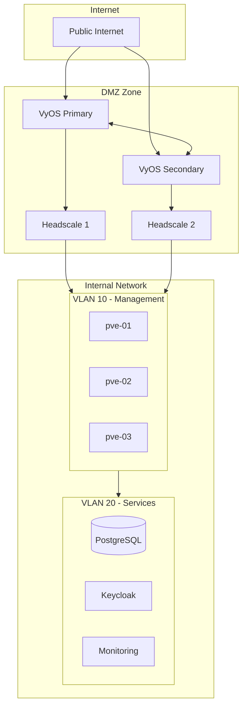
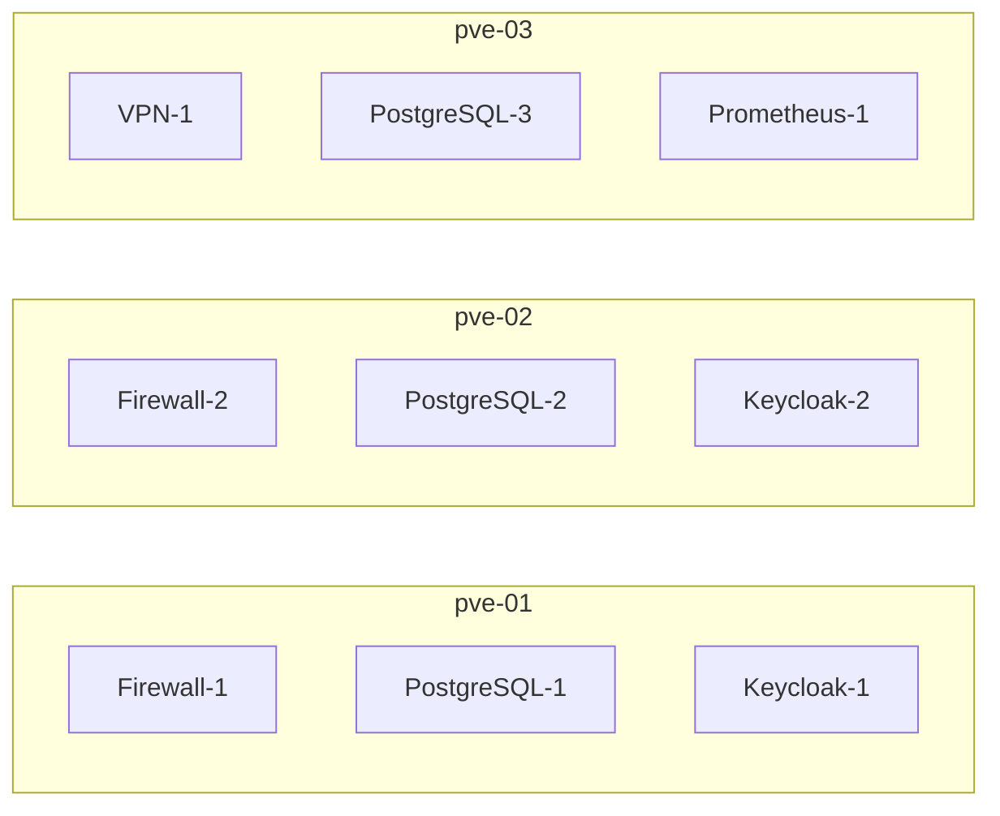
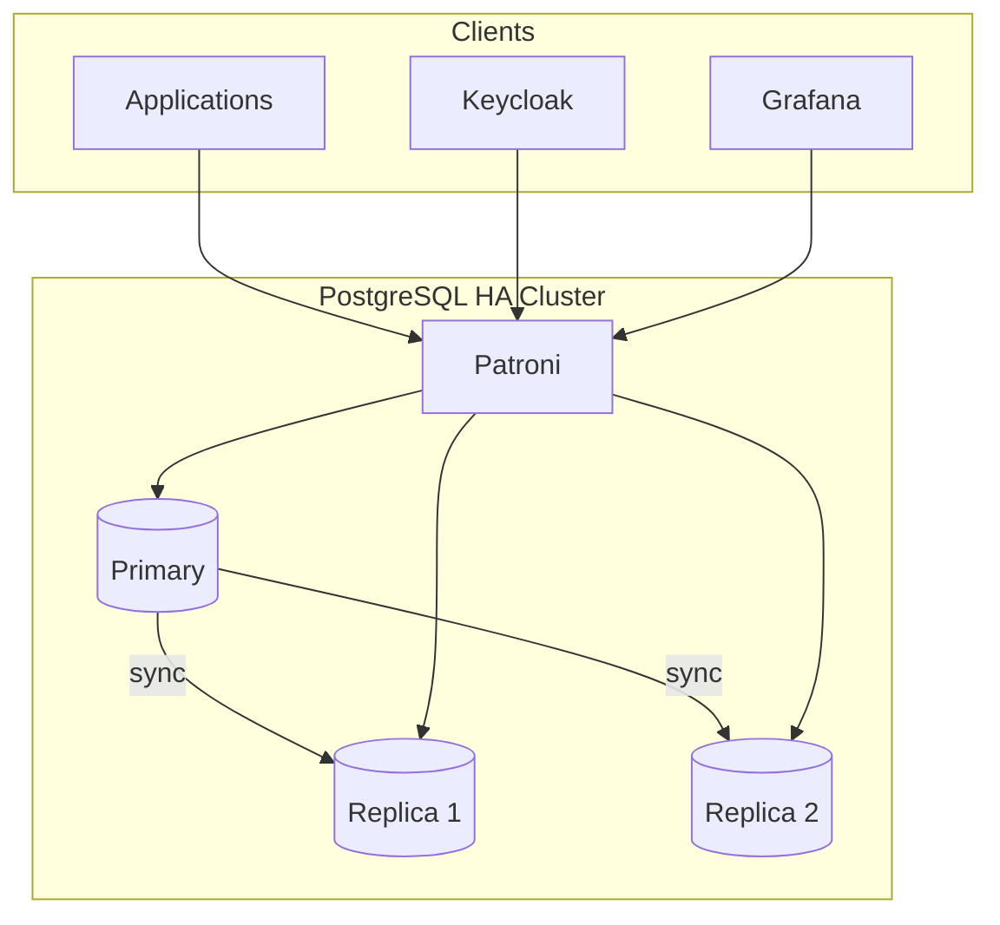

# First Deployment

Complete guide to deploying Soverstack in production.

## Overview

This guide walks through deploying a full production infrastructure including:
- 3-node Proxmox cluster
- VyOS firewall pair
- Headscale VPN
- PostgreSQL HA cluster
- Keycloak SSO
- Full observability stack
- Kubernetes cluster (optional)

## Deployment Phases

```mermaid
gantt
    title Deployment Timeline
    dateFormat X
    axisFormat %s
    
    section Phase 1
    Datacenter Setup    :a1, 0, 1
    
    section Phase 2
    Networking          :a2, 1, 2
    
    section Phase 3
    Compute VMs         :a3, 2, 3
    
    section Phase 4
    Databases           :a4, 3, 4
    
    section Phase 5
    Deploy & Verify     :a5, 4, 5
```



## Phase 1: Datacenter Setup

### 1.1 Prepare Proxmox Servers

Ensure all servers have:
- Proxmox VE 8.x installed
- Network configured with VLANs
- SSH access enabled

### 1.2 Configure Datacenter Layer

See [Datacenter Layer](../03-layers/datacenter.md) for full reference.

```yaml
# datacenter.yaml
name: dc-production

servers:
  - name: pve-01
    id: 1
    ip: "10.0.0.10"
    port: 22
    os: proxmox
    password:
      type: vault
      path: secret/data/proxmox/pve-01
    disk_encryption:
      enabled: true
      password:
        type: vault
        path: secret/data/encryption/disk
```

## Phase 2: Networking

### Network Architecture



### 2.1 Configure Networking Layer

See [Networking Layer](../03-layers/networking.md) for full reference.

```yaml
# networking.yaml
public_ip:
  type: allocated_block
  cidr: "203.0.113.0/28"
  gateway: "203.0.113.1"
  allocation:
    firewall: "203.0.113.2"
    vpn: "203.0.113.3"
    ingress: "203.0.113.4"

firewall:
  enabled: true
  type: vyos
  vm_ids: [1, 2]

vpn:
  enabled: true
  type: headscale
  vm_ids: [100, 101]
  oidc_enforced: true
```

## Phase 3: Compute

### 3.1 VM Distribution



### 3.2 Configure Compute Layer

```yaml
# compute.yaml
instance_type_definitions:
  - name: app-medium
    cpu: 4
    ram: 8
    disk: 100
    disk_type: distributed
    os_template: debian-12-cloudinit

virtual_machines:
  - name: myapp-01
    vm_id: 3001
    host: pve-01
    role: general_purpose
    type_definition: app-medium
```

## Phase 4: Databases

### Database Cluster Architecture



### 4.1 Configure Database Layer

See [Database Layer](../03-layers/databases.md) for full reference.

```yaml
# database.yaml
databases:
  - type: postgresql
    version: "16"
    cluster:
      name: pg-apps
      ha: true
      vm_ids: [250, 251, 252]
    ssl: required
    databases:
      - name: myapp
        owner: myapp_user
    credentials:
      type: vault
      path: secret/data/postgres/apps
```

## Phase 5: Deployment

### 5.1 Validate

```bash
soverstack validate platform.yaml --verbose
```

### 5.2 Plan

```bash
soverstack plan platform.yaml
```

Review the plan carefully before proceeding.

### 5.3 Apply

```bash
soverstack apply platform.yaml
```

Deployment typically takes 30-60 minutes depending on infrastructure size.

## Phase 6: Post-Deployment

### 6.1 Connect to VPN

1. Get Headscale auth key from deployment output
2. Install Tailscale client
3. Connect: `tailscale up --login-server https://vpn.yourdomain.com --authkey YOUR_KEY`

### 6.2 Access Services

| Service | URL |
|---------|-----|
| Grafana | `https://grafana.yourdomain.com` |
| Keycloak | `https://auth.yourdomain.com` |
| Prometheus | `https://prometheus.yourdomain.com` |

### 6.3 Initial Configuration

1. **Keycloak**: Create admin user and realm
2. **Grafana**: Configure data sources
3. **Alertmanager**: Set up notification channels

## Troubleshooting

### Common Issues

| Issue | Solution |
|-------|----------|
| VM creation fails | Check Proxmox storage and network |
| VPN not connecting | Verify firewall rules |
| Database connection refused | Check SSL certificates |

See [Troubleshooting Guide](../06-operations/troubleshooting.md) for more.

## Next Steps

- Configure [Kubernetes](../05-kubernetes/README.md)
- Set up [Monitoring Alerts](../04-services/prometheus-monitoring.md)
- Add [Applications](../03-layers/apps.md)
