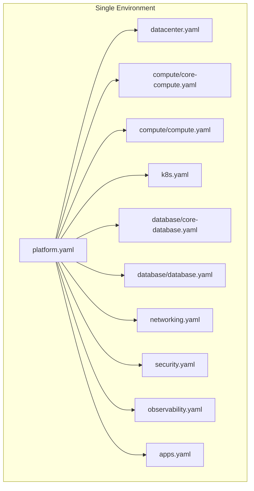

# Installation

This guide covers installing the Soverstack CLI.

## Install via npm

```bash
npm install -g @soverstack/cli
```

## Verify Installation

```bash
soverstack --version
```

## Initialize a New Project

```bash
soverstack init my-infrastructure
cd my-infrastructure
```

### Single Environment Structure

```
my-infrastructure/
├── platform.yaml          # Main entry point
├── datacenter.yaml        # Physical servers (Proxmox)
├── compute/
│   ├── core-compute.yaml  # Infrastructure VMs (auto-generated)
│   └── compute.yaml       # Your application VMs
├── k8s.yaml               # Kubernetes cluster
├── database/
│   ├── core-database.yaml # Infrastructure databases (auto-generated)
│   └── database.yaml      # Your application databases
├── networking.yaml        # DNS, VPN, Firewall
├── security.yaml          # Vault, SSO (Keycloak)
├── observability.yaml     # Prometheus, Grafana, Loki
├── apps.yaml              # Applications
├── ssh_config.yaml        # SSH keys + port knocking
├── .env                   # Environment variables
├── .gitignore
├── README.md
└── .soverstack/
    ├── state/
    ├── logs/
    └── cache/
```

### Multi-Environment Structure

With environments (e.g., `soverstack init my-infra --env prod,staging`):

```
my-infrastructure/
├── shared/
│   ├── security.yaml
│   ├── apps.yaml
│   └── observability.yaml
├── environments/
│   ├── prod/
│   │   ├── platform.yaml
│   │   ├── datacenter.yaml
│   │   ├── compute/
│   │   │   ├── core-compute.yaml
│   │   │   └── compute.yaml
│   │   ├── k8s.yaml
│   │   ├── database/
│   │   │   ├── core-database.yaml
│   │   │   └── database.yaml
│   │   ├── networking.yaml
│   │   ├── ssh_config.yaml
│   │   └── .env              # Environment-specific variables
│   └── staging/
│       └── ...
├── .env                       # Global shared variables
├── .gitignore
├── README.md
└── .soverstack/
    ├── prod/
    │   ├── state/
    │   └── logs/
    ├── staging/
    │   ├── state/
    │   └── logs/
    └── cache/
```

### Multi-Datacenter Structure

With datacenters (e.g., `soverstack init my-infra --dc paris,frankfurt`):

```
my-infrastructure/
├── platform.yaml              # References all datacenters
├── shared/
│   ├── security.yaml          # Shared across DCs
│   └── observability.yaml
├── datacenters/
│   ├── paris/
│   │   ├── datacenter.yaml    # Paris servers + backup_servers
│   │   ├── compute/
│   │   │   ├── core-compute.yaml
│   │   │   └── compute.yaml
│   │   ├── k8s.yaml
│   │   ├── database/
│   │   │   ├── core-database.yaml
│   │   │   └── database.yaml
│   │   ├── networking.yaml
│   │   ├── ssh_config.yaml
│   │   └── .env               # Paris-specific variables
│   └── frankfurt/
│       └── ...
├── .env                       # Global shared variables
├── .gitignore
├── README.md
└── .soverstack/
    ├── paris/
    │   ├── state/
    │   └── logs/
    └── frankfurt/
        ├── state/
        └── logs/
```

### Multi-Environment + Multi-Datacenter Structure

With both (e.g., `soverstack init my-infra --env prod,staging --dc paris,frankfurt`):

```
my-infrastructure/
├── shared/
│   ├── security.yaml          # Shared across all envs and DCs
│   └── apps.yaml
├── environments/
│   ├── prod/
│   │   ├── platform.yaml      # Prod entry point
│   │   ├── shared/
│   │   │   └── observability.yaml  # Shared within prod
│   │   └── datacenters/
│   │       ├── paris/
│   │       │   ├── datacenter.yaml
│   │       │   ├── compute/
│   │       │   ├── database/
│   │       │   ├── networking.yaml
│   │       │   ├── ssh_config.yaml
│   │       │   └── .env       # Prod-Paris variables
│   │       └── frankfurt/
│   │           └── ...
│   └── staging/
│       └── ...
├── .env                       # Global shared variables
├── .gitignore
├── README.md
└── .soverstack/
    ├── prod/
    │   ├── paris/
    │   └── frankfurt/
    └── staging/
        ├── paris/
        └── frankfurt/
```

### Project Structure Diagram



### Core Files vs Custom Files

| File | Type | Description |
|------|------|-------------|
| `compute/core-compute.yaml` | Auto-generated | Infrastructure VMs (VyOS, Headscale, PostgreSQL, etc.) |
| `compute/compute.yaml` | Custom | Your application VMs |
| `database/core-database.yaml` | Auto-generated | Infrastructure databases (keycloak, headscale, etc.) |
| `database/database.yaml` | Custom | Your application databases |

## Configuration

### Environment Variables

Soverstack uses `.env` files with variable naming conventions based on your structure:

**Single Environment** (project root `.env`):
```bash
# Server Credentials
ROOT_PASSWORD_PVE01=your-password-here

# SSH Keys
SSH_PUBLIC_KEY=ssh-ed25519 AAAA...
SSH_PRIVATE_KEY=/path/to/key
```

**Multi-Environment** (suffixed with environment name):
```bash
# In environments/prod/.env
SSH_PUBLIC_KEY_PROD=ssh-ed25519 AAAA...
ROOT_PASSWORD_PVE01_PROD=your-password

# In environments/staging/.env
SSH_PUBLIC_KEY_STAGING=ssh-ed25519 AAAA...
ROOT_PASSWORD_PVE01_STAGING=your-password
```

**Multi-Datacenter** (suffixed with datacenter name):
```bash
# In datacenters/paris/.env
SSH_PUBLIC_KEY_PARIS=ssh-ed25519 AAAA...
ROOT_PASSWORD_PVE01_PARIS=your-password
ROOT_PASSWORD_BACKUP01_PARIS=your-password

# In datacenters/frankfurt/.env
SSH_PUBLIC_KEY_FRANKFURT=ssh-ed25519 AAAA...
ROOT_PASSWORD_PVE01_FRANKFURT=your-password
```

**Multi-Environment + Multi-Datacenter** (suffixed with both):
```bash
# In environments/prod/datacenters/paris/.env
SSH_PUBLIC_KEY_PROD_PARIS=ssh-ed25519 AAAA...
ROOT_PASSWORD_PVE01_PROD_PARIS=your-password
```

### SSH Keys

Generate SSH keys during init:

```bash
soverstack init my-infrastructure --generate-ssh
```

Or generate later:

```bash
soverstack generate:ssh-keys
```

## Validate Configuration

```bash
soverstack validate platform.yaml
```

## Next Steps

Continue to [Quick Start](./quick-start.md) for a rapid deployment guide.
