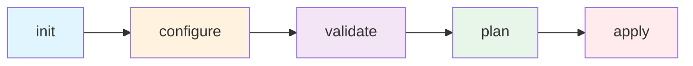
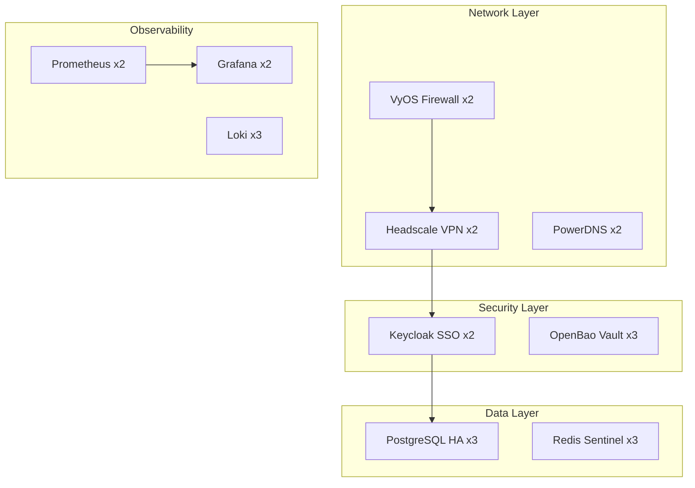

# Quick Start

Deploy a complete infrastructure in 10 minutes.

## Prerequisites

- 3 Proxmox VE servers ready
- SSH access configured
- Public IP block (optional)

## Deployment Flow



## Step 1: Initialize Project

```bash
soverstack init my-prod --tier production
cd my-prod
```

## Step 2: Configure Datacenter

Edit `datacenter.yaml`:

```yaml
name: dc-primary

servers:
  - name: pve-01
    id: 1
    ip: "192.168.1.10"
    port: 22
    os: proxmox
    password:
      type: env
      var_name: PVE_PASSWORD_01
    disk_encryption:
      enabled: true
      password:
        type: env
        var_name: DISK_ENCRYPTION_PASSWORD

  - name: pve-02
    id: 2
    ip: "192.168.1.11"
    port: 22
    os: proxmox
    password:
      type: env
      var_name: PVE_PASSWORD_02

  - name: pve-03
    id: 3
    ip: "192.168.1.12"
    port: 22
    os: proxmox
    password:
      type: env
      var_name: PVE_PASSWORD_03
```

## Step 3: Set Environment Variables

Edit `.env`:

```bash
PVE_PASSWORD_01=your-pve01-password
PVE_PASSWORD_02=your-pve02-password
PVE_PASSWORD_03=your-pve03-password
DISK_ENCRYPTION_PASSWORD=your-encryption-password
```

## Step 4: Validate Configuration

```bash
soverstack validate platform.yaml
```

Expected output:
```
✓ Datacenter configuration valid
✓ Networking configuration valid
✓ Compute configuration valid (32 VMs)
✓ Database configuration valid (1 cluster, 5 databases)
✓ All validations passed
```

## Step 5: Review Plan

```bash
soverstack plan platform.yaml
```

## Step 6: Deploy

```bash
soverstack apply platform.yaml
```

## What Gets Deployed



| Component | Count | Purpose |
|-----------|-------|---------|
| VyOS Firewall | 2 | HA firewall with VRRP |
| Headscale VPN | 2 | Zero-trust VPN access |
| PostgreSQL | 3 | HA database cluster |
| Keycloak | 2 | SSO/IAM |
| Prometheus | 2 | Monitoring |
| Grafana | 2 | Dashboards |

## Access Your Infrastructure

After deployment:

1. **VPN Access**: Connect via Headscale
2. **Grafana**: `https://grafana.yourdomain.com`
3. **Keycloak**: `https://auth.yourdomain.com`

## Next Steps

- Read [First Deployment](./first-deployment.md) for detailed walkthrough
- Configure [Kubernetes Cluster](../05-kubernetes/cluster-architecture.md)
- Add your [Applications](../03-layers/apps.md)
