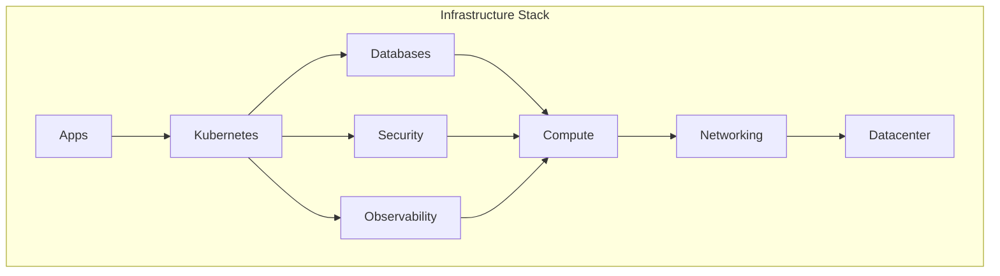

# Architecture

This section covers Soverstack platform architecture, design decisions, and conventions.

## Contents

1. [Overview](./overview.md) - High-level architecture
2. [Infrastructure Tiers](./infrastructure-tiers.md) - local vs production vs enterprise
3. [VM ID Ranges](./vm-id-ranges.md) - Reserved ID conventions
4. [Network Design](./network-design.md) - Network architecture
5. [Security Model](./security-model.md) - Zero-trust security

## Architecture Principles

### 1. Layer-Based Design

Infrastructure is organized into independent layers:

### 2. High Availability by Default

Production and enterprise tiers require HA for all critical services:
- Minimum 3 servers for quorum
- Redundant VMs for each service
- Automatic failover

### 3. Zero-Trust Security

- All access through VPN (Headscale)
- OIDC enforced for authentication
- No direct SSH to VMs
- Secrets in OpenBao/Vault

### 4. Infrastructure as Code

- Declarative YAML configuration
- Version controlled
- Reproducible deployments
- Audit trail

## Component Overview

| Component | Purpose | HA Mechanism |
|-----------|---------|--------------|
| VyOS | Firewall | VRRP |
| Headscale | VPN | LB + shared DB |
| PostgreSQL | Database | Patroni + etcd |
| Keycloak | IAM | Infinispan cluster |
| OpenBao | Secrets | Raft consensus |
| Prometheus | Monitoring | Dual scrape |
| Grafana | Dashboards | LB + shared DB |

## Next Steps

Start with [Overview](./overview.md) for a high-level understanding.
