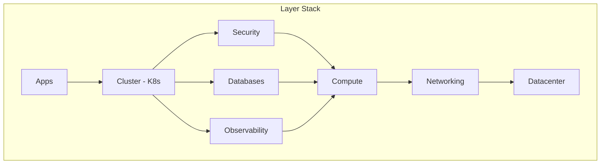

# Layers

Soverstack organizes infrastructure into logical layers, each configured independently.

## Layer Overview

| Layer | File(s) | Purpose |
|-------|---------|---------|
| [Datacenter](./datacenter.md) | `datacenter.yaml` | Physical Proxmox servers |
| [Networking](./networking.md) | `networking.yaml` | Firewall, VPN, DNS |
| [Compute](./compute.md) | `compute/core-compute.yaml`, `compute/compute.yaml` | Virtual machines |
| [Databases](./databases.md) | `databases/core-databases.yaml`, `databases/databases.yaml` | PostgreSQL clusters |
| [Cluster](./cluster.md) | `cluster.yaml` | Kubernetes configuration |
| [Security](./security.md) | `security.yaml` | IAM, secrets management |
| [Observability](./observability.md) | `observability.yaml` | Monitoring, logging |
| [Apps](./apps.md) | `apps.yaml` | Applications |

## Layer Dependencies



## Multi-File Support

Some layers support multiple files (comma-separated):

```yaml
# platform.yaml
layers:
  datacenter: "layers/datacenter.yaml"
  networking: "layers/networking.yaml"
  compute: "layers/compute/core-compute.yaml,layers/compute/compute.yaml"
  database: "layers/databases/core-databases.yaml,layers/databases/databases.yaml"
  cluster: "layers/cluster.yaml"
  apps: "layers/apps.yaml"
```

### Merge Rules

| Property Type | Behavior |
|---------------|----------|
| Arrays | Concatenated |
| Objects | Error if duplicate |
| Primitives | Error if duplicate |

### Example Error

```
❌ ERROR: Property 'firewall' declared in multiple files
   - networking-base.yaml (line 12)
   - networking.yaml (line 5)

   Define 'firewall' in one file only.
```

## Core vs Custom Files

| File Pattern | Purpose | Modify? |
|--------------|---------|---------|
| `core-*.yaml` | Auto-generated infrastructure | ❌ No |
| `*.yaml` | Your custom configuration | ✅ Yes |

### Core Files

Generated by Soverstack with mandatory infrastructure:

- `core-compute.yaml` - Infrastructure VMs (VyOS, Headscale, PostgreSQL, etc.)
- `core-databases.yaml` - Mandatory databases (keycloak, headscale, powerdns, openbao)

### Custom Files

Your configuration:

- `compute.yaml` - Your application VMs
- `databases.yaml` - Your application databases

## Configuration in platform.yaml

```yaml
# platform.yaml
project_name: my-infrastructure
domain: example.com
environment: production
infrastructure_tier: production
version: "1.0.0"

layers:
  datacenter: "layers/datacenter.yaml"
  networking: "layers/networking.yaml"
  compute: "layers/compute/core-compute.yaml,layers/compute/compute.yaml"
  database: "layers/databases/core-databases.yaml,layers/databases/databases.yaml"
  cluster: "layers/cluster.yaml"
  security: "layers/security.yaml"
  observability: "layers/observability.yaml"
  apps: "layers/apps.yaml"

ssh: "layers/ssh.yaml"

state:
  backend: local
  path: .soverstack/state
```

## Validation

Validate all layers:

```bash
soverstack validate
```

Validate specific layer:

```bash
soverstack validate --layer compute
```

## Next Steps

Start with [Datacenter](./datacenter.md) as the foundational layer.
