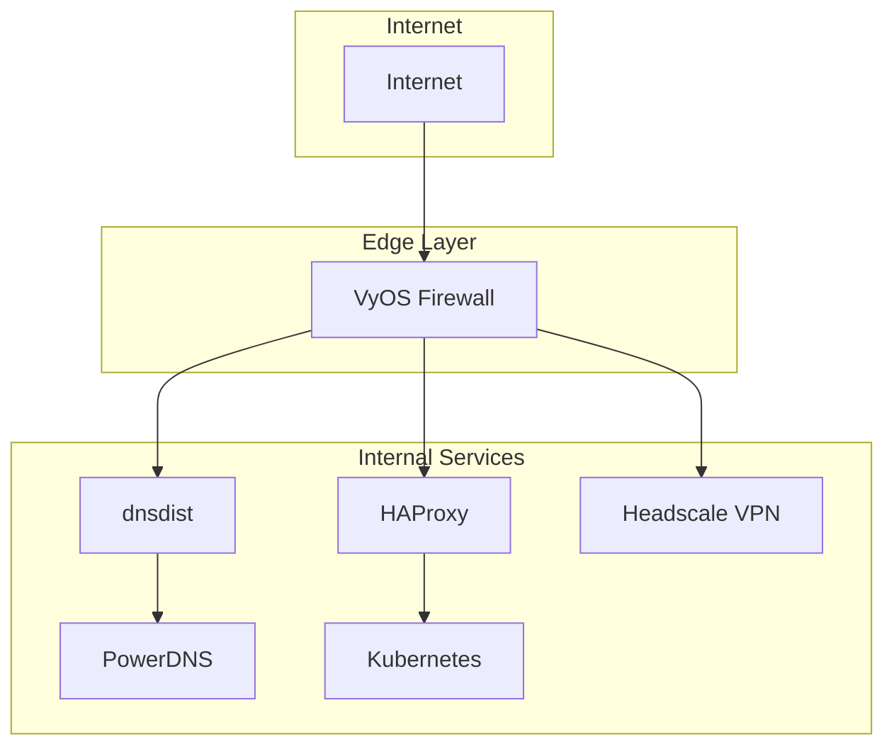
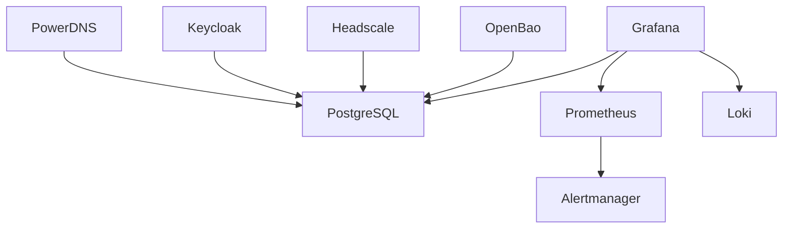

# Services Documentation

This section documents each service deployed by Soverstack.

## Core Infrastructure Services

| Service | Purpose | Documentation |
|---------|---------|---------------|
| [VyOS Firewall](vyos-firewall.md) | Network security, routing | Firewall rules, NAT, VPN |
| [PowerDNS](powerdns.md) | Authoritative DNS | Zone management, DNSSEC |
| [dnsdist](dnsdist.md) | DNS load balancing | Query routing, caching |

## Networking Services

| Service | Purpose | Documentation |
|---------|---------|---------------|
| [Headscale VPN](headscale-vpn.md) | Zero-trust networking | Mesh VPN, ACLs |
| [HAProxy](haproxy.md) | Load balancing | TCP/HTTP balancing |

## Security Services

| Service | Purpose | Documentation |
|---------|---------|---------------|
| [Keycloak IAM](keycloak-iam.md) | Identity management | SSO, OIDC, SAML |
| [OpenBao Secrets](openbao-secrets.md) | Secrets management | KV store, PKI, transit |

## Database Services

| Service | Purpose | Documentation |
|---------|---------|---------------|
| [PostgreSQL + Patroni](postgresql-patroni.md) | Relational database | HA, replication, backup |

## Observability Services

| Service | Purpose | Documentation |
|---------|---------|---------------|
| [Prometheus Monitoring](prometheus-monitoring.md) | Metrics collection | Scraping, alerting rules |
| [Grafana Dashboards](grafana-dashboards.md) | Visualization | Dashboards, data sources |
| [Loki Logging](loki-logging.md) | Log aggregation | LogQL, retention |
| [Wazuh SIEM](wazuh-siem.md) | Security monitoring | Threat detection, compliance |

## Service Architecture

## High Availability Patterns

All production services follow HA patterns:

| Pattern | Services | Description |
|---------|----------|-------------|
| Active-Passive | VyOS, PostgreSQL | VRRP failover |
| Active-Active | dnsdist, HAProxy | Load balanced |
| Cluster | etcd, Patroni | Consensus-based |
| Mesh | Headscale, Loki | Peer-to-peer |

## Service Dependencies

## Configuration Sources

Services are configured from multiple layers:

| Layer | Provides |
|-------|----------|
| `platform.yaml` | Domain, tier, datacenter |
| `networking.yaml` | VPN, DNS, firewall rules |
| `compute.yaml` | VM specs, placement |
| `databases.yaml` | Database connections |
| `security.yaml` | IAM, secrets |
| `apps.yaml` | Subdomain routing |
