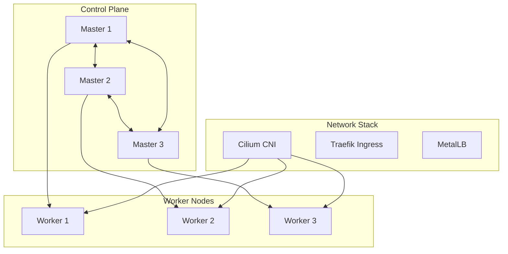

# Kubernetes Documentation

This section covers Kubernetes cluster architecture and management.

## Contents

1. [Cluster Architecture](./cluster-architecture.md) - K8s cluster design
2. [Cilium CNI](./cilium-cni.md) - Container networking
3. [Traefik Ingress](./traefik-ingress.md) - Ingress controller
4. [Cert-Manager](./cert-manager.md) - Certificate automation
5. [ArgoCD GitOps](./argocd-gitops.md) - GitOps deployment
6. [Velero Backup](./velero-backup.md) - Cluster backup

## Overview

Soverstack deploys production-ready Kubernetes clusters with:

- HA control plane (3+ masters)
- Cilium CNI with eBPF
- Traefik ingress controller
- MetalLB for LoadBalancer services
- ArgoCD for GitOps
- Velero for backup/restore

## Cluster Architecture

## Cluster Schema

See [`K8sCluster`](../08-reference/types/K8sCluster.md) for the full type definition.
