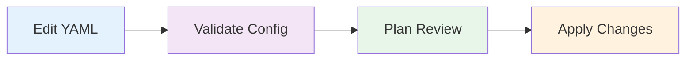

# Operations Documentation

This section covers daily operations and management of Soverstack infrastructure.

## Contents

1. [Deployment Workflow](./deployment-workflow.md) - How to deploy changes
2. [Validation](./validation.md) - Validating configuration
3. [Apply Changes](./apply-changes.md) - Applying infrastructure changes
4. [Rollback](./rollback.md) - Rolling back changes
5. [Troubleshooting](./troubleshooting.md) - Common issues and solutions

## CLI Commands Overview

| Command | Description |
|---------|-------------|
| `soverstack init` | Initialize a new project |
| `soverstack validate` | Validate configuration |
| `soverstack plan` | Preview changes |
| `soverstack apply` | Apply changes |
| `soverstack destroy` | Destroy infrastructure |

## Workflow

