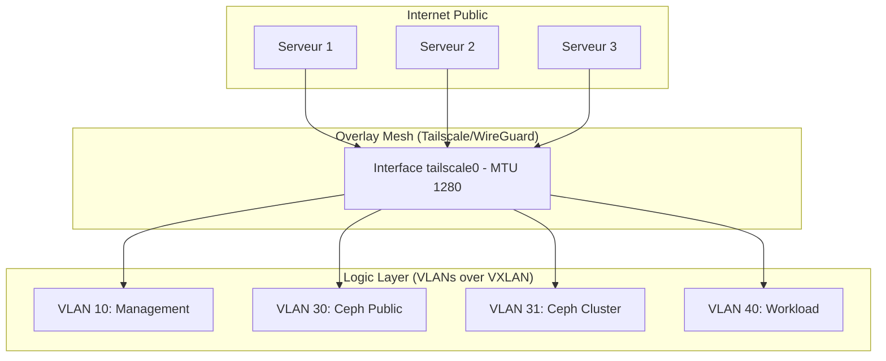
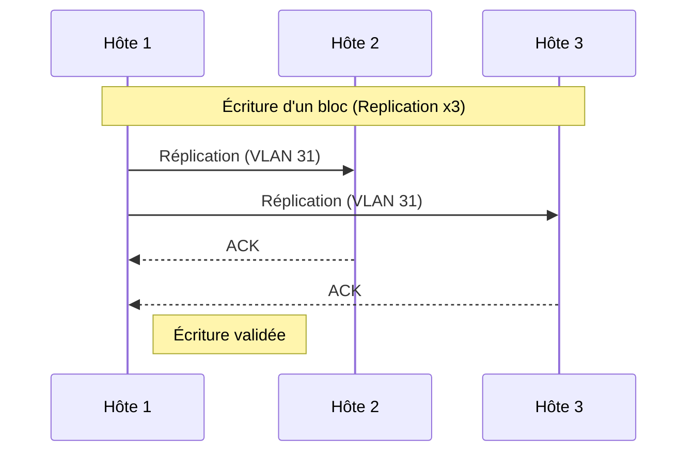

# Architecture du Cluster Souverain Datacenter

Cette documentation détaille la création et l'organisation du cluster **Datacenter** basé sur Proxmox, Ceph et un réseau Mesh privé géré par Headscale.

## 1. Vision Globale

L'infrastructure repose sur le concept **BYOH (Bring Your Own Host)**. Elle transforme trois serveurs dédiés (minimal) isolés en un cloud privé unifié, hautement disponible et sécurisé par un chiffrement de bout en bout.

### Pile Technologique

- **Hyperviseur :** Proxmox VE 8.x
- **Réseau (SDN) :** Tailscale (WireGuard Mesh) piloté par Headscale.
- **Base de Données :** PostgreSQL HA (Patroni) pour le contrôle réseau.
- **Stockage :** Ceph (Hyper-convergé).

---

## 2. Architecture Réseau (Layer 2 over Layer 3)

Le réseau est organisé en couches pour garantir l'isolation et la sécurité, même sur Internet public.



---

## 3. Workflow de Bootstrap (Zéro Dépendance)

Le déploiement suit une séquence stricte pour éviter le verrouillage circulaire (deadlock).

### Étape 1 : Le Cerveau Local (Seed)

Installation sur le stockage local du **Serveur 1** pour initialiser le réseau.

- Déploiement du cluster **PostgreSQL HA** (3 VMs).
- Déploiement de **Headscale** (LXC).
- Ouverture du tunnel Tailscale sur les 3 hôtes via l'IP publique du Serveur 1.

### Étape 2 : Le Cluster de Stockage

Une fois le réseau Mesh établi :

- Création du cluster Proxmox via les IPs privées Tailscale.
- Initialisation de **Ceph** sur les interfaces Mesh.

### Étape 3 : Migration vers la Haute Disponibilité

Une fois Ceph `HEALTH_OK` :

- Migration à chaud (Live Migration) des disques de Headscale et Postgres vers le pool Ceph.
- Activation de la HA Proxmox pour le plan de contrôle.

---

## 4. Organisation du Stockage Ceph

Ceph sépare les flux pour maximiser les performances malgré l'encapsulation réseau.

| Réseau           | VLAN | MTU  | Description                               |
| ---------------- | ---- | ---- | ----------------------------------------- |
| **Ceph Public**  | 30   | 1280 | Trafic entre les VMs et le stockage.      |
| **Ceph Cluster** | 31   | 1280 | Réplication et heartbeat entre les hôtes. |



---

## 5. Gestion du MTU et Overhead

Pour garantir la stabilité sur n'importe quel hébergeur (Hetzner, OVH, etc.), nous appliquons une politique de MTU conservatrice.

| Couche                    | Taille (Octets)         |
| ------------------------- | ----------------------- |
| **Ethernet Standard**     | 1500                    |
| **WireGuard (Tailscale)** | -60                     |
| **VXLAN (Overhead)**      | -50                     |
| **MTU Final VM**          | **1280** (Safe Default) |

> **Note Expert :** Si le client dispose d'un lien 10G local, le mode **Jumbo Frames** peut être activé (MTU 9000), augmentant le MTU effectif à ~8890.

---

## 6. Sécurité et Accès Secours

1. **Firewall :** Seul le port UDP de WireGuard (51820) est ouvert sur l'IP publique.
2. **Accès Root :** Le SSH sur l'IP publique est limité aux clés Ed25519 (mots de passe désactivés).
3. **Isolement :** Le trafic entre clients est isolé par des Namespaces Headscale distincts.

---

```

### Pourquoi cette structure pour Docusaurus ?
1. **Mermaid.js :** Docusaurus supporte nativement Mermaid. Tes graphiques seront rendus proprement dans le navigateur.
2. **Tableaux :** Idéal pour comparer les VLANs et les MTU d'un coup d'œil.
3. **Callouts (Admonitions) :** Les blocs `> **Note**` permettent de mettre en avant les points critiques comme le MTU.

**Souhaites-tu que j'ajoute une section spécifique sur la configuration YAML de ton interface de gestion pour que l'utilisateur puisse suivre son déploiement ?**

```
