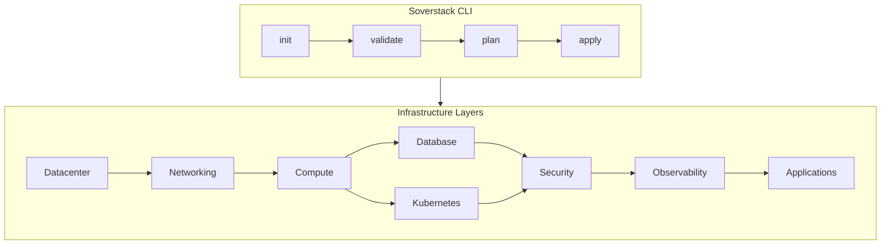

# Soverstack Documentation

Welcome to the Soverstack documentation. This guide covers everything you need to deploy and manage a production-grade infrastructure platform.

## What is Soverstack?

Soverstack is an Infrastructure-as-Code platform that provisions and manages:
- **Proxmox VE clusters** with HA and Ceph storage
- **Zero-trust networking** with VyOS firewall and Headscale VPN
- **Kubernetes clusters** with Cilium CNI and Traefik ingress
- **Database clusters** with PostgreSQL Patroni HA
- **Observability stack** with Prometheus, Grafana, Loki
- **Security infrastructure** with Keycloak SSO and OpenBao secrets

## Architecture Overview

## Documentation Structure

### [01 - Getting Started](./01-getting-started/README.md)
Installation, prerequisites, and your first deployment.

### [02 - Architecture](./02-architecture/README.md)
Platform architecture, infrastructure tiers, VM ID conventions, and security model.

### [03 - Layers](./03-layers/README.md)
Configuration reference for each infrastructure layer:
- Datacenter (physical servers)
- Networking (firewall, VPN, DNS)
- Compute (VMs and instances)
- Databases (PostgreSQL clusters)
- Cluster (Kubernetes)
- Security (IAM, secrets)
- Observability (monitoring, logging)
- Apps (applications)

### [04 - Services](./04-services/README.md)
Detailed configuration guides for each service:
- VyOS Firewall
- Headscale VPN
- PowerDNS
- Keycloak IAM
- OpenBao Secrets
- PostgreSQL with Patroni
- Redis Sentinel
- Prometheus & Grafana
- Loki & Wazuh

### [05 - Kubernetes](./05-kubernetes/README.md)
Kubernetes cluster setup, networking, ingress, storage, and GitOps.

### [06 - Operations](./06-operations/README.md)
Deployment workflows, validation, scaling, and troubleshooting.

### [07 - Runbooks](./07-runbooks/README.md)
Emergency procedures, failover guides, and incident response.

### [08 - Reference](./08-reference/README.md)
Complete schema reference for all types and configurations.

### [10 - Deep Dive](./10-deep-dive/01-index.md)
Deep technical documentation: datacenter bootstrap, software mesh architecture, VM details.

### [99 - Appendix](./99-appendix/README.md)
Glossary, FAQ, changelog, and migration guides.

## Quick Links

| Topic | Link |
|-------|------|
| Installation | [Getting Started](./01-getting-started/installation.md) |
| Platform Schema | [platform.yaml Reference](./08-reference/platform-yaml-schema.md) |
| VM ID Ranges | [VM ID Conventions](./02-architecture/vm-id-ranges.md) |
| Infrastructure Tiers | [local vs production vs enterprise](./02-architecture/infrastructure-tiers.md) |
| CLI Commands | [Command Reference](./08-reference/cli-commands.md) |

## Infrastructure Tiers

| Tier | Use Case | HA | Min Servers |
|------|----------|----|-------------|
| `local` | Development | No | 1 |
| `production` | Production workloads | Yes | 3 |
| `enterprise` | Enterprise with compliance | Yes | 3+ |

## Support

- GitHub Issues: [github.com/soverstack/cli/issues](https://github.com/soverstack/cli/issues)
- Documentation: [docs.soverstack.io](https://docs.soverstack.io)
